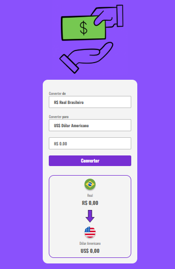

# 💸 Convert Money - DevClub

Este projeto foi desenvolvido durante o curso do **Dev Club** na seção de **Front-End** para fins de aprendizado.  
O objetivo é criar uma aplicação simples de **conversão de moedas** utilizando HTML, CSS e JavaScript, consumindo dados de uma API de câmbio em tempo real.

---

## 🚀 Tecnologias utilizadas
- **HTML5** → estrutura da página  
- **CSS3** → estilização e layout responsivo  
- **JavaScript (ES6+)** → lógica da aplicação  
- **[AwesomeAPI](https://docs.awesomeapi.com.br/)** → consumo das taxas de câmbio  

---

## 📌 Funcionalidades
✅ Conversão entre as seguintes moedas:
- Real Brasileiro (BRL)  
- Dólar Americano (USD)  
- Euro (EUR)  
- Bitcoin (BTC)  

✅ Atualização das taxas de câmbio em **tempo real** via API  
✅ Exibição com formatação monetária correta para cada moeda  
✅ Alteração dinâmica de bandeiras, nomes e placeholders conforme seleção  

---

## 📂 Estrutura do projeto
📦 convert-money

┣ 📂 assets # Imagens e ícones usados no projeto

┣ 📜 index.html # Estrutura da aplicação

┣ 📜 styles.css # Estilização

┣ 📜 scripts.js # Lógica da conversão

┗ 📜 README.md # Documentação do projeto

---


---

## 🖼️ Preview


---

## ⚙️ Como executar
1. Clone este repositório:
   ```bash
   git clone https://github.com/seu-usuario/convert-money.git
   ```
2. Acesse a pasta do projeto:
   ```
   cd convert-money
   ```
3. Abra o arquivo **index.html** no navegador de sua preferência.

---

## 📚 Aprendizados

 Durante o desenvolvimento deste projeto foi possível praticar:

- Consumo de APIs com fetch e async/await
  
- Manipulação do DOM com JavaScript

- Uso de Intl.NumberFormat para formatação de moedas

- Estruturação e estilização com HTML e CSS

---

## 👨‍💻 Autor

Projeto desenvolvido por [Ariel Vasconcelos](https://github.com/arielvasconcelosgoncalves) no curso do Dev Club 🚀
